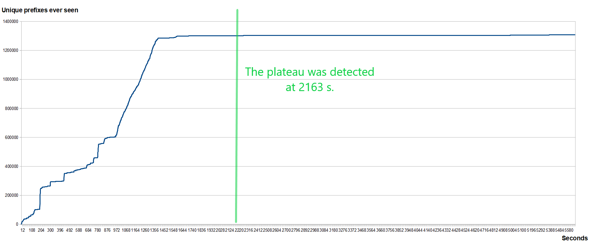
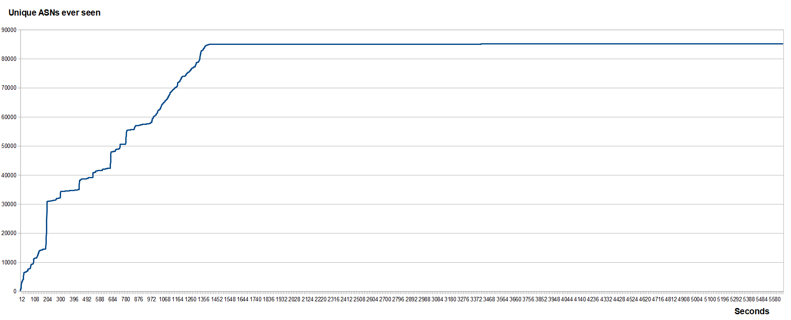

# ASNPrefixMap

ASNPrefixMap is a C++ tool for building a practical mapping
between IP prefixes and origin ASNs using BGP observations.

The system aggregates BGP announcements from multiple peers
and derives a stable prefix -> ASN mapping.

## Features

- prefix-centric routing state
- per-peer BGP observations
- correct withdraw handling
- export of prefix -> ASN tables
- export of ASN -> prefix reverse index
- configuration via config.ini
- offline replay of raw RIS Live JSON messages
- live RIPE RIS Live WebSocket ingestion
- snapshot save/load of internal routing observations
- runtime peer registry with numeric PeerId
- binary runtime prefix storage for IPv4 and IPv6
- optional periodic growth statistics CSV output
- small-vector optimization for per-prefix observations
- heuristic plateau notification based on prefix growth rate
- graceful shutdown on Ctrl+C / SIGTERM
- automatic reconnect for transient RIS Live WebSocket drops

## Ingestion Flow

The source layer always returns raw RIS Live JSON messages.
The main pipeline is:

source -> raw JSON -> parser -> BgpEvent -> PeerRegistry -> binary prefix parse -> RoutingState

`file_jsonl` is a replay source for raw RIS Live JSON lines.
`ris_live_ws` is a live WebSocket source using the same parser flow.
The live source now auto-reconnects after transient read or connection failures and resends the RIS Live subscription.

## Growth Stats

`stats_output_enabled` enables periodic CSV sampling.
`stats_interval_ms` sets the sampling interval.
`stop_on_keypress` enables a local Enter-to-stop helper for interactive runs.

When stats output is enabled, the program creates a fresh file per run using a timestamped name such as
`stats_2026-03-16_142224.csv`.

`plateau_detection_enabled` enables heuristic plateau detection.
`plateau_window_samples` controls the rolling average window size.
`plateau_prefix_rate_threshold` is the average `new_prefixes_per_sec` threshold.
`plateau_min_runtime_sec` prevents early detection before enough runtime has elapsed.

Ever-seen ASN/prefix counts are tracked separately from active counts so temporary withdrawals do not reset growth history.
Periodic sampling is intended for empirical growth measurement and future saturation estimation, not readiness detection yet.
Plateau detection is only a heuristic and does not formally prove the table is complete.

## Reconnect

`reconnect_enabled` controls live WebSocket reconnect behavior.
`reconnect_initial_delay_ms` and `reconnect_max_delay_ms` control simple reconnect backoff.
`reconnect_max_attempts` limits reconnect tries, where `0` means unlimited.

Reconnect is best-effort. The process stays alive across transient connection failures, but live updates may still be missed during the outage window.
Shutdown requests stop reconnect attempts so the process can exit cleanly.

## Shutdown

Ctrl+C and SIGTERM trigger graceful shutdown.
The program stops ingesting, flushes stats, saves snapshot state, exports tables, and exits through the normal cleanup path.
In the current synchronous design, a blocking source read may delay shutdown slightly until the next read returns.

## Snapshots

`snapshot_input` restores internal per-peer observations before new messages are processed.
`snapshot_output` saves the internal routing state on normal shutdown.

Snapshots preserve the internal observations required for correct withdraw handling after restart.
They do not store only the final prefix -> ASN export, because the export alone loses per-peer state.
Snapshot and export remain text-based so they stay easy to inspect manually, while runtime keeps normalized binary prefixes.

## Runtime State

Runtime state stores peer references as numeric `PeerId` values via `PeerRegistry`.
It now stores IPv4 and IPv6 prefixes in separate binary maps. Prefixes remain text only at parser, snapshot, and export boundaries.
Observation storage uses `boost::container::small_vector` with inline capacity 4 because most prefixes are expected to have only a few peer observations.

## Example

Input events:

{"type":"ris_message","data":{"type":"UPDATE","host":"rrc00","peer":"192.0.2.1","peer_asn":64500,"timestamp":1710000000,"path":[64500,64496,15169],"announcements":[{"prefixes":["8.8.8.0/24"]}]}}

Output:
8.8.8.0/24 15169

## Build

mkdir build
cd build
cmake ..
make

## Roadmap

- MRT file replay
- IPv6 support
- ASN metadata enrichment
- IP longest-prefix lookup

## Dataset Convergence (Plateau Detection)

The system tracks how quickly new routing information is discovered over time.

Initially, the number of unique prefixes and ASNs grows rapidly as data is ingested
from the live BGP stream. Over time, the growth rate decreases and stabilizes,
indicating that most globally visible routes have already been observed.

Plateau detection is based on a rolling average of prefix discovery rate.

### Prefix growth



The system reaches a plateau at ~2163 seconds (~36 minutes), after which
the number of newly discovered prefixes becomes negligible.

### ASN growth



ASN discovery stabilizes shortly after prefix growth, confirming that
the routing table is broadly complete.

### Example run

```text
[plateau] uptime_sec=2163.51 uptime_hms=00:36:03
[plateau] active_prefixes=1293782 total_unique_asns_ever_seen=84951
[plateau] note=table appears broadly complete; you may stop if a stable mapping is enough

runtime_sec=5697.49
runtime_hms=01:34:57
plateau_detected=true
plateau_uptime_sec=2163.51
plateau_uptime_hms=00:36:03
```

